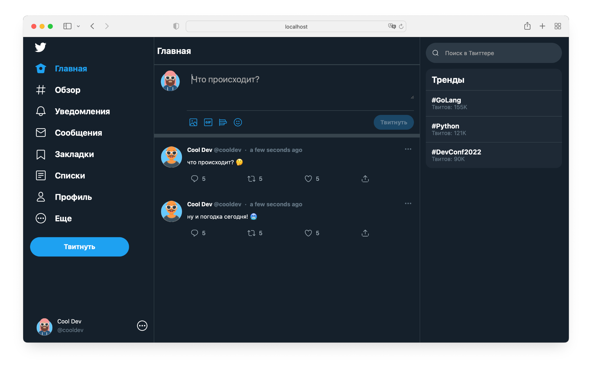
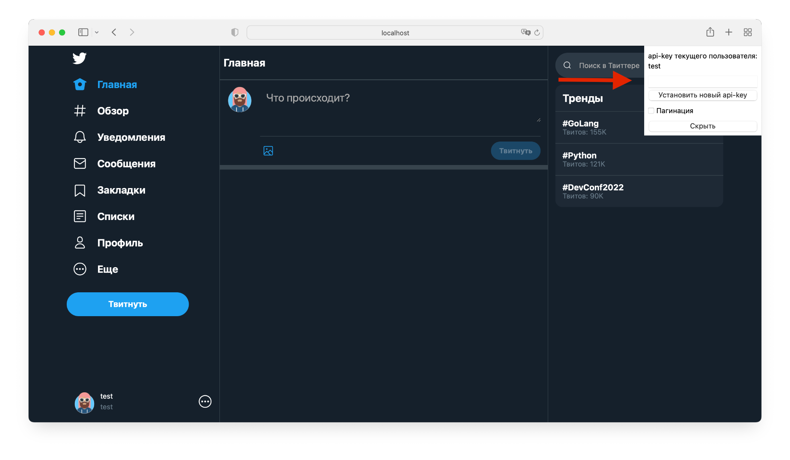

# Сервис микроблогов

### Приложение представляет собой социальную сеть, в которой пользователи публикуют сообщения ("твиты"):


- [x] **Прокси-сервер: Nginx**
- [x] **Сервер: FastAPI**
- [x] **База данных: PostgreSQL**

<br>


1. Перед запуском приложения необходимо создать файл .env, добавив в него 
собственные значения переменных окружения (указаны в файле .env_template).

<br>

2. Запуск приложения осуществляется командой:
   ```
   docker-compose up
   ```
<br>

3. Сервис доступен по адресу: <http://localhost/>

<br>

4. После запуска приложения доступна Swagger-документация:
<http://localhost/docs>

<br>

5. При инициализации сервиса БД заполняется данными о пользователях, их api-keys, 
а также о подписках. Доступные api-keys: test, test2, test3, test4.

<br>

6. Аутентификация пользователя происходит через установление Http-header "api-key":

Авторизация происходит автоматически после установки api-key.

<br>

7. Пользователь может:
- добавить/удалить твит;
- подписаться/отписаться от другого пользователя;
- добавлять/удалять лайк с твита;
- получить ленту из твитов;
- добавить к твиту изображение.

<br>

8. Вся информация, измененная и полученная в ходе работы (твиты, лайки, подписки, медиа) 
не теряется и сохраняется при отключении и повторном запуске приложения.

<br>

9. **В приложении**:
- можно настраивать логирование;
- реализованы тесты.
